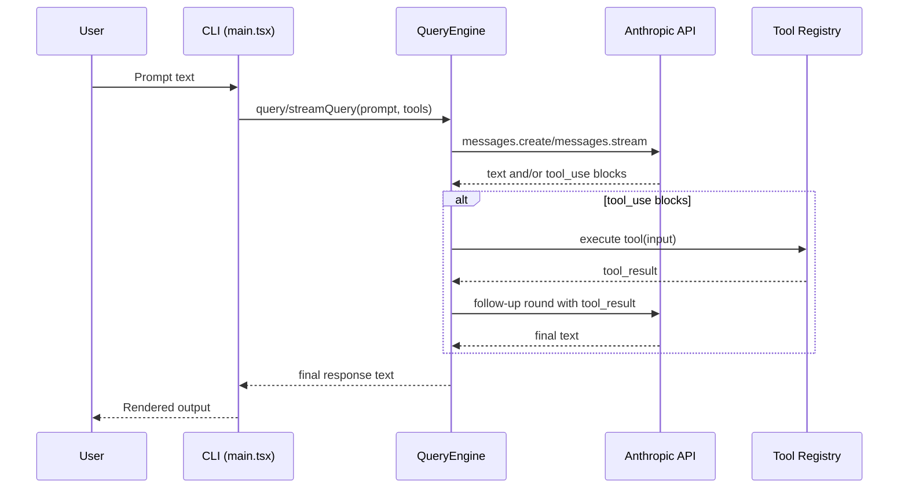

# Architecture Overview

Reo Agent is a terminal-first coding assistant built around a small set of composable modules.

## Runtime flow

1. The CLI entrypoint in `src/main.tsx` parses options and starts interactive mode.
2. User messages are routed through command parsing in `src/commands/index.ts`.
3. Non-slash input is sent to `QueryEngine` in `src/QueryEngine.ts`.
4. The model may request tool execution through the registered tools in `src/tools/index.ts`.
5. Tool results are fed back to the model until a final text answer is produced.

## Key modules

- `src/main.tsx`: CLI setup, REPL loop, command dispatch, streaming/non-streaming output.
- `src/commands/index.ts`: Slash commands (`/help`, `/config`, `/cost`, `/doctor`, etc.).
- `src/QueryEngine.ts`: LLM client orchestration, tool call loop, usage tracking.
- `src/tools/FileTools.ts`: File search/read/write/edit and grep/glob operations.
- `src/tools/BashTools.ts`: Shell command execution and web fetch support.
- `src/config/index.ts`: YAML config loading, validation, and persistence.
- `src/App.tsx`, `src/components/*`: Ink UI components used by the TUI path.

## Data and state

- Config source order: defaults -> `~/.config/reo-agent/config.yaml` -> runtime overrides.
- Conversation state: in-memory message history inside `QueryEngine`.
- Tool execution state: in-memory tool call history in `QueryEngine`.
- Session usage state: input/output token counters and API call count.

## Error handling strategy

- Commands fail fast with user-facing messages for invalid input.
- Tool execution errors are converted to model-visible `tool_result` errors.
- CLI-level exceptions are caught and printed with a consistent error prefix.

## Sequence diagram

